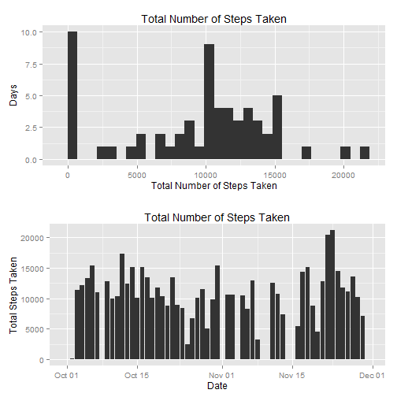
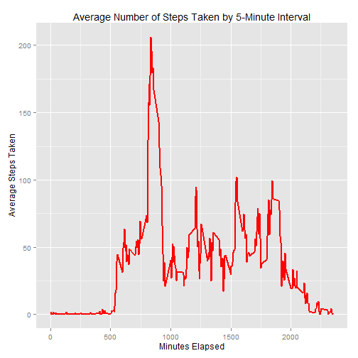
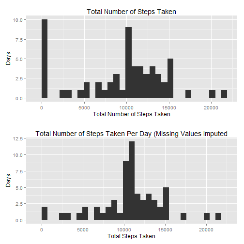
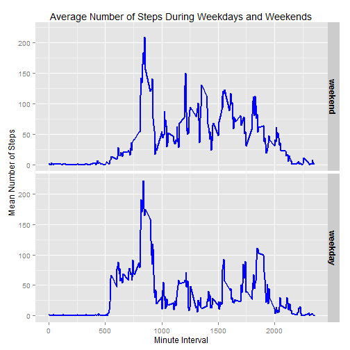

Reproducible Research Peer Assessment 1 - September 2015
========================================================

# Introduction

It is now possible to collect a large amount of data about personal movement 
using activity monitoring devices such as a Fitbit, Nike Fuelband, or Jawbone Up. 
These type of devices are part of the "quantified self" movement - a group of 
enthusiasts who take measurements about themselves regularly to improve their 
health, to find patterns in their behavior, or because they are tech geeks. But 
these data remain under-utilized both because the raw data are hard to obtain 
and there is a lack of statistical methods and software for processing and 
interpreting the data.

This assignment makes use of data from a personal activity monitoring device. 
This device collects data at 5 minute intervals through out the day. The data 
consists of two months of data from an anonymous individual collected during the 
months of October and November, 2012 and include the number of steps taken in 
5 minute intervals each day.

# Data

The data for this assignment is downloaded from the course web site.
The variables included in this dataset are:
* steps: Number of steps taken in a 5-minute interval (missing values are coded as NA)
* date: The date on which the measurement was taken in YYYY-MM-DD format
* interval: Identifier for the 5-minute interval in which measurement was taken
The dataset is stored in a comma-seperated-value (CSV) file and there are a total 
of 17,568 observations

# Assignment

## Load Packages and Multiplot Function
Multiplot Function provided by [Cookbook for R](http://www.cookbook-r.com/Graphs/Multiple_graphs_on_one_page_(ggplot2)/) Accessed on 9/18/2015.


```r
packages <- c("dplyr", "ggplot2")
lapply(packages, library, character.only = TRUE)
```

```
## [[1]]
##  [1] "grid"      "ggplot2"   "dplyr"     "knitr"     "stats"    
##  [6] "graphics"  "grDevices" "utils"     "datasets"  "methods"  
## [11] "base"     
## 
## [[2]]
##  [1] "grid"      "ggplot2"   "dplyr"     "knitr"     "stats"    
##  [6] "graphics"  "grDevices" "utils"     "datasets"  "methods"  
## [11] "base"
```

```r
# Multiple plot function
#
# ggplot objects can be passed in ..., or to plotlist (as a list of ggplot objects)
# - cols:   Number of columns in layout
# - layout: A matrix specifying the layout. If present, 'cols' is ignored.
#
# If the layout is something like matrix(c(1,2,3,3), nrow=2, byrow=TRUE),
# then plot 1 will go in the upper left, 2 will go in the upper right, and
# 3 will go all the way across the bottom.
#
multiplot <- function(..., plotlist=NULL, file, cols=1, layout=NULL) {
        library(grid)
        
        # Make a list from the ... arguments and plotlist
        plots <- c(list(...), plotlist)
        
        numPlots = length(plots)
        
        # If layout is NULL, then use 'cols' to determine layout
        if (is.null(layout)) {
                # Make the panel
                # ncol: Number of columns of plots
                # nrow: Number of rows needed, calculated from # of cols
                layout <- matrix(seq(1, cols * ceiling(numPlots/cols)),
                                 ncol = cols, nrow = ceiling(numPlots/cols))
        }
        
        if (numPlots==1) {
                print(plots[[1]])
                
        } else {
                # Set up the page
                grid.newpage()
                pushViewport(viewport(layout = grid.layout(nrow(layout), ncol(layout))))
                
                # Make each plot, in the correct location
                for (i in 1:numPlots) {
                        # Get the i,j matrix positions of the regions that contain this subplot
                        matchidx <- as.data.frame(which(layout == i, arr.ind = TRUE))
                        
                        print(plots[[i]], vp = viewport(layout.pos.row = matchidx$row,
                                                        layout.pos.col = matchidx$col))
                }
        }
}
```

## Loading and Preprocessing Data


```r
#Create and set working directory
#dir.create("coursera/repdata/courseproject1", recursive = TRUE)
setwd("./coursera/repdata/courseproject1")
```

```
## Error in setwd("./coursera/repdata/courseproject1"): cannot change working directory
```

```r
#Download dataset from course website
fileUrl <- "https://d396qusza40orc.cloudfront.net/repdata%2Fdata%2Factivity.zip"

if(!file.exists("./repdata%2Fdata%2Factivity.zip")) {
        download.file(fileUrl, "./repdata%2Fdata%2Factivity.zip")
        unzip("./repdata%2Fdata%2Factivity.zip")
}

#Read in activity data
activity <- read.csv("./activity.csv")

#Reformat date variable
activity <- mutate(activity, 
                   date = as.Date(date, format = "%Y-%m-%d"))
```

## Questions

### What is the mean total number of steps taken per day?

For this part of the assignment, you can ignore the missing values in the dataset.

1. Calculate the total number of steps taken per day.


```r
#Aggregate steps by date
steps <- group_by(activity, date) %>% summarize(total = sum(steps, na.rm = TRUE))
```

2. If you do not understand the difference between a histogram and a barplot,
research the difference between them. Make a histogram of the total number of 
steps taken each day.


```r
#Create histogram plot of total steps taken using ggplot2
plot1 <- ggplot(steps, aes(total)) + geom_histogram() + 
        labs(title = "Total Number of Steps Taken") +
        labs(x = expression("Total Number of Steps Taken")) +
        labs(y = expression("Days"))
#print(plot1)

#Create bar chart of total steps taken over time for comparison, using ggplot2
plot2 <- ggplot(steps, aes(date, total)) + geom_bar(stat = "identity") + 
        labs(title = "Total Number of Steps Taken") +
        labs(x = expression("Date")) + 
        labs(y = expression("Total Steps Taken"))
#print(plot2)

#Utilize multiplot function to compare two charts
multiplot(plot1, plot2)
```

```
## stat_bin: binwidth defaulted to range/30. Use 'binwidth = x' to adjust this.
```

 

3. Calculate and report the mean and median of the total number of steps taken 
per day.


```r
#Calculate mean and median of total steps taken per day
averagetotalsteps <- mean(steps$total)
mediantotalsteps <- median(steps$total)
print(averagetotalsteps)
```

```
## [1] 9354.23
```

```r
print(mediantotalsteps)
```

```
## [1] 10395
```

### What is the average daily activity pattern?

1. Make a time series plot (i. e. `type = "l"`) of the 5-minute interval (x-axis)
and the average number of steps taken, averaged across all days (y-axis).


```r
#Calculate mean of steps taken for each interval across all days
intervals <- group_by(activity, interval) %>% 
        summarize(avgsteps = mean(steps, na.rm = TRUE))

#Plot mean steps taken for each interval
plot3 <- ggplot(intervals, aes(interval, avgsteps)) + 
        geom_line(colour = "red", size = 1) +
        labs(title = "Average Number of Steps Taken by 5-Minute Interval") +
        labs(x = expression("Minutes Elapsed")) +
        labs(y = expression("Average Steps Taken"))
print(plot3)
```

 

2. Which 5-minute interval, on average across all the days in the dataset, 
contains the maximum number of steps?


```r
#Calculate interval with greatest average steps taken
maxinterval <- intervals$interval[which.max(intervals$avgsteps)]
print(maxinterval)
```

```
## [1] 835
```

### Imputing missing values

Note that there are a number of days/intervals where there are missing values
(code as `NA`). The presence of missing days may introduce bias into some 
calculations or summaries of the data.

1. Calculate and report the total number of missing values in the dataset (i.e. 
the total number of rows with `NA`s).


```r
#Calculate number of missing values in the dataset 
missingvalues <- sum(is.na(activity$steps))
print(c("# of Missing Values", missingvalues))
```

```
## [1] "# of Missing Values" "2304"
```

2. Devise a stategy for filling in all of the missing values in the dataset.
__I use the average of the specific time interval across all days.__

3. Create a new dataset that is equal to the original dataset but with the
missing data filled in.


```r
#Fill in missing values for steps taken by using the mean of steps taken within
#respective 5-minute interval for all non-missing values
imputedactivity <- activity

for (i in 1:nrow(activity)) {
        if(is.na(activity$steps[i]) == TRUE) {
                id <- activity$interval[i] 
                imputedactivity$steps[i] = mean(activity$steps[activity$interval == id], 
                                         na.rm = TRUE)
        }
}
```

4. Make a histogram of the total number of steps taken each day and calculate 
and report the __mean__ and __median__ total number of steps taken per day. Do 
these values differ from the estimates from the first part of the assignment? 
What is the impact of imputing missing data on the estimates of the total daily 
number of steps?


```r
#Calculate total number of steps taken by date
imputedsteps <- group_by(imputedactivity, date) %>% summarize(total = sum(steps))

plot4 <- ggplot(imputedsteps, aes(total)) + 
        geom_histogram() +
        labs(title = "Total Number of Steps Taken Per Day (Missing Values Imputed") +
        labs(x = expression("Total Steps Taken")) +
        labs(y = expression("Days"))
#print(plot4)

multiplot(plot1, plot4)
```

```
## stat_bin: binwidth defaulted to range/30. Use 'binwidth = x' to adjust this.
## stat_bin: binwidth defaulted to range/30. Use 'binwidth = x' to adjust this.
```

 

```r
#Calculate mean and median of total steps taken per day
imputedaveragetotalsteps <- mean(imputedsteps$total)
imputedmediantotalsteps <- median(imputedsteps$total)

#Compare mean of total steps taken between original and imputed dataset 
print(c("Original Mean", averagetotalsteps))
```

```
## [1] "Original Mean"    "9354.22950819672"
```

```r
print(c("Imputed Mean", imputedaveragetotalsteps))
```

```
## [1] "Imputed Mean"     "10766.1886792453"
```

```r
#Compare median of total steps taken between original and imputed dataset 
print(c("Original Median", mediantotalsteps))
```

```
## [1] "Original Median" "10395"
```

```r
print(c("Imputed Median", imputedmediantotalsteps))
```

```
## [1] "Imputed Median"   "10766.1886792453"
```
__Imputing the missing values clearly increases the total daily number of steps.__

### Are there differences in activity patterns between weekdays and weekends?

For this part the `weekdays()` function may be of some help here. Use the 
dataset with the filled-in missing values for this part.

1. Create a new factor variable in the dataset with two levels --"weekday" and
"weekend" indicating whether a given data is a weekday or weekend day.


```r
#Construct factor variable indicating the part of the week for each observation
imputedactivity <- mutate(imputedactivity, day = weekdays(date)) %>%
        mutate(partofweek = ifelse(day == "Friday" | day == "Saturday" | 
                                           day == "Sunday", "weekend", "weekday")) %>%
        mutate(partofweek = factor(partofweek, levels = c("weekend", "weekday")))

table(imputedactivity$partofweek)
```

```
## 
## weekend weekday 
##    7200   10368
```

2. Make a panel plot containing a time series plot (i.e. `type = "l"`) of the
5-minute interval (x-axis) and the average number of steps taken, averaged across
all weekday days or weekend days (y-axis).


```r
#Average the number of steps taken for each interval across days within weekdays
#or weekends
weekcomparison <- group_by(imputedactivity, partofweek, interval) %>% 
        summarize(averagesteps = mean(steps))

#Plot the average number of steps taken during weekdays and weekends
plot5 <- ggplot(weekcomparison, aes(interval, averagesteps)) + geom_line(colour = "Blue", 
                                                               size = 1) +
        facet_grid(partofweek ~ .) + 
        labs(title = "Average Number of Steps During Weekdays and Weekends") +
        labs(x = expression("Minute Interval")) +
        labs(y = expression("Mean Number of Steps")) +
        theme(strip.text.y = element_text(size = 12, face = "bold"))
print(plot5)
```

 
